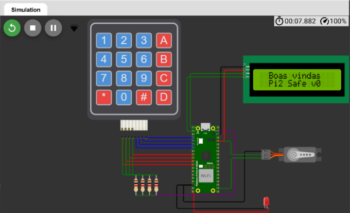
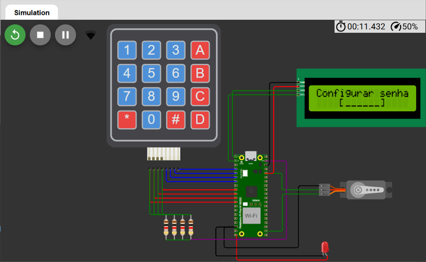
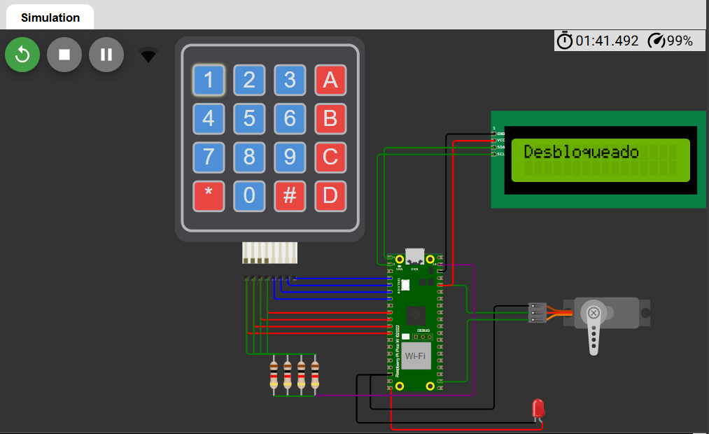
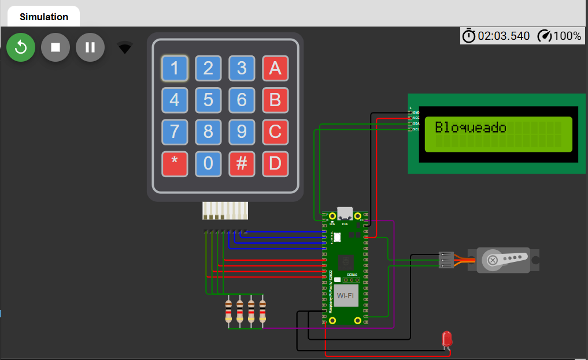
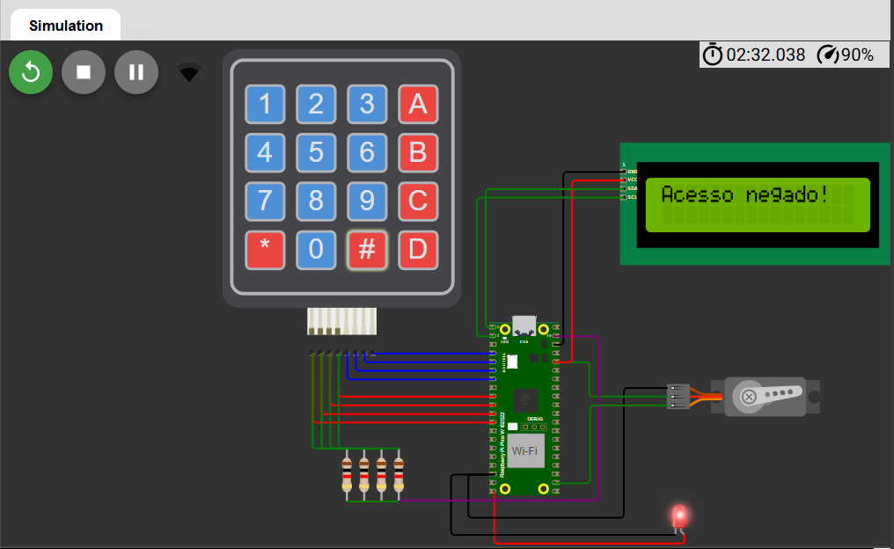

<h5 align="right">
    This file is also available in <a href=https://github.com/carolinebraz/pi2safe/blob/main/README.md> English </a> :us:
</h5>

# <p align="center"> Pi2Safe 🔐 </p>

Um **protótipo virtual de fechadura inteligente** desenvolvido com `Raspberry Pi Pico W` e `MicroPython` como parte de um estudo sobre as principais vulnerabilidades dos sistemas IoT em edificações inteligentes. Com o objetivo de testar a eficácia de medidas de proteção, o dispositivo incorpora criptografia SHA-256 e bloqueio progressivo contra tentativas repetidas de acesso não autorizado. 
	
Pensado para ser 100% reproduzível sem necessidade de investimentos em hardware físico, instalação de softwares ou registro de contas, o protótipo foi implementado utilizando o [Wokwi](https://wokwi.com/), um simulador online de circuitos que permite prototipagem gratuita de projetos IoT.

• [Funcionalidades](#funcionalidades-sparkles)  
• [Imagens](#imagens-art)  
• [Requisitos](#requisitos-warning)  
• [Tecnologias](#tecnologias-computer)  
• [Executando o projeto](#executando-o-projeto-arrow_forward)  
• [Deploy](#deploy-rocket)  
• [Licença](#licença-lock)

---

### Funcionalidades :sparkles:  
- [x] Cadastro e verificação de senha (numérica, alfanumérica e com caracteres especiais) 
- [x] Interface via teclado matricial 4x4  
- [x] Display LCD I2C 
- [x] Controle da fechadura com servo motor  
- [x] LED indicador de acesso negado
- [x] Conexão Wi-Fi 
- [x] Mensagens publicadas via MQTT
- [x] Criptografia SHA-256 para o armazenamento da senha
- [x] Bloqueio progressivo após tentativas inválidas de acesso 
- [x] Simulação completa via Wokwi

---

### Imagens :art:  
Boas vindas | Configurar senha | Desbloqueado | Bloqueado | Acesso negado  
:---:|:---:|:---:|:---:|:---:  
 |  |  |  |   

Para mais detalhes, acesse: [Pi2Safe](https://wokwi.com/projects/437135539858937857)

---

### Requisitos :warning:  
Para simular o sistema você só precisa de:

- :computer: Computador (desktop ou notebook)  
- :globe_with_meridians: Navegador (Edge, Chrome, Firefox...)
- :signal_strength: Acesso à internet

---

### Tecnologias :computer:  
- [MicroPython](https://micropython.org/)  
- [Raspberry Pi Pico W](https://www.raspberrypi.com/products/raspberry-pi-pico/)  
- [Simulador Wokwi](https://wokwi.com/)  
- LCD 1602 via PCF8574  
- Teclado matricial 4x4  
- Servo motor SG90  
- GPIO / PWM / I2C

---

### Executando o projeto :arrow_forward:
1. Clone o repositório:

```bash
git clone https://github.com/carolinebraz/pi2safe.git
```

2. Acesse [Novo projeto MicroPython no Raspberry Pi Pico W - Simulador Wokwi](https://wokwi.com/projects/new/micropython-pi-pico-w)

3. Substitua o conteúdo dos arquivos existentes no Wokwi pelo conteúdo dos respectivos arquivos do repositório:

```
- main.py
- diagram.json
```

4. Faça upload dos outros arquivos no site. Para isso, clique na seta ao lado de `diagram.json` :arrow_down_small: e escolha a opção `Upload file(s)...`. Abra a pasta `pi2safe` do repositório clonado e selecione os seguintes arquivos:

```
- i2c_lcd.py
- keypad.py
- lcd_api.py
- lcd_display.py
- security.py
- servo.py
- setup_wifi.py
- umqtt.py
```

5. Clique em :arrow_forward: para iniciar a simulação

6. Se estiver tudo certo até aqui o sistema realizará a conexão e, em seguida, exibirá a tela para configurar senha

7. Agora é só digitar uma senha utilizando o teclado matricial e testar o funcionamento da fechadura :smiley:

---

### Deploy :rocket:

Este projeto encontra-se temporariamente disponível de forma gratuita no Wokwi 

- [Pi2Safe](https://wokwi.com/projects/437135539858937857) :closed_lock_with_key:

---

### Licença :lock:

Copyright © 2025 - Pi2Safe by Caroline Braz

[Licença MIT](./LICENSE)