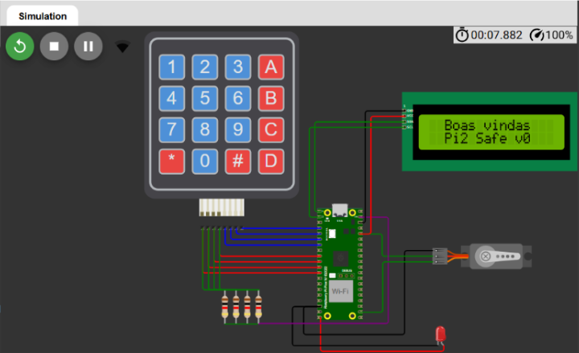
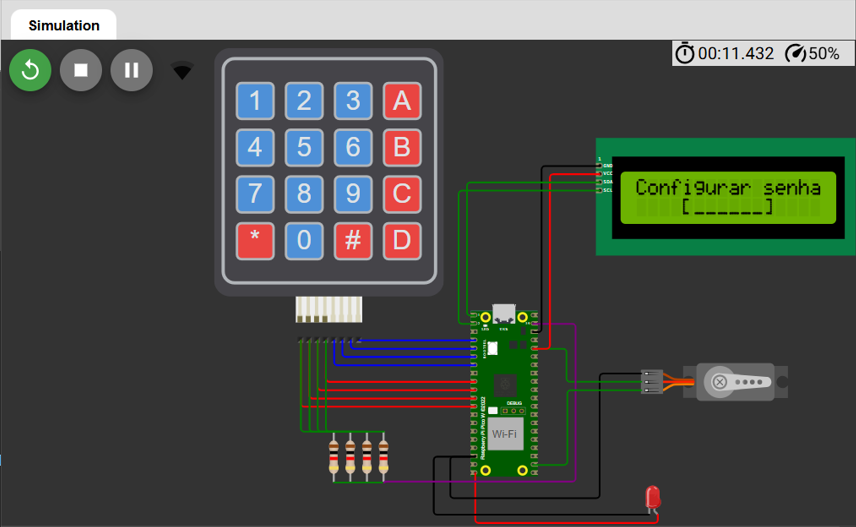
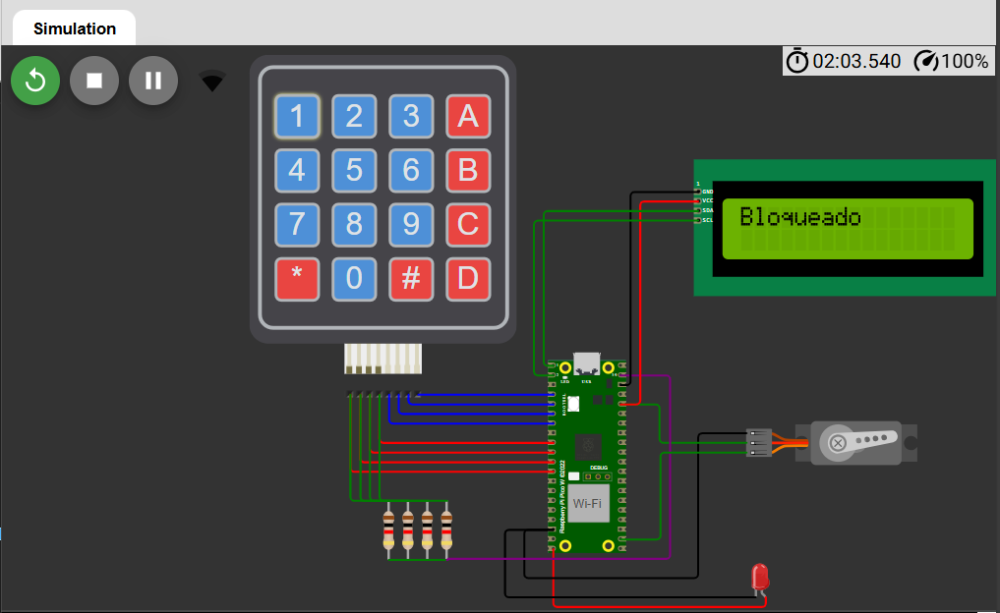

<h5 align="right">Este arquivo também está disponível em <a href=https://github.com/carolinebraz/pi2safe/blob/main/README-pt.md> Português </a> 🇧🇷</h5>

# <p align="center"> Pi2 Safe 🔐 </p>

A **virtual smart lock prototype** built using `Raspberry Pi Pico W` and `MicroPython`, developed as part of a study on key vulnerabilities in IoT systems for smart buildings. To test the effectiveness of protective measures, the device includes SHA-256 encryption and progressive blocking against repeated unauthorized access attempts.

The prototype was designed to be fully reproducible without requiring any physical hardware, software installation, or user registration. For that, it was implemented on [Wokwi](https://wokwi.com/), a free online electronics simulator that allows quick prototyping of IoT projects with no setup or signup.

• [Features](#features-sparkles)  
• [Images](#images-art)  
• [Requirements](#requirements-warning)  
• [Technologies](#technologies-computer)  
• [Run](#run-arrow_forward)  
• [License](#license-lock)

---

### Features :sparkles:
- [x] Password creation and verification (numeric, alphanumeric, special characters)
- [x] 4x4 keypad interface
- [x] LCD I2C display
- [x] Lock control using servo motor
- [x] Access denied indicator via LED
- [x] Wi-Fi connectivity
- [x] MQTT message publishing
- [x] SHA-256 password encryption
- [x] Progressive lockout after invalid attempts
- [x] Full simulation via Wokwi

---

### Images :art:
Welcome | Set password | Unlocked | Locked | Access denied
:---:|:---:|:---:|:---:|:---: 
 |  |  |  | 

---

### Requirements :warning:
To simulate the system you’ll only need:
- :computer: A computer (desktop or notebook)
- :globe_with_meridians: A browser (Edge, Chrome, Firefox...)
- :signal_strength: Internet access

---

### Technologies :computer:
- [MicroPython](https://micropython.org/)  
- [Raspberry Pi Pico W](https://www.raspberrypi.com/products/raspberry-pi-pico/)  
- [Wokwi Simulator](https://wokwi.com/)
- 1602 LCD via PCF8574
- 4x4 matrix keypad
- SG90 servo motor
- GPIO / PWM / I2C

---

### Run :arrow_forward:
1. Clone the repository:

```bash
git clone https://github.com/carolinebraz/pi2safe.git
```

2. Go to [New MicroPython on Raspberry Pi Pico W Project - Wokwi Simulator](https://wokwi.com/projects/new/micropython-pi-pico-w)

3. Replace the default Wokwi files with these from the repository:

```
- main.py
- diagram.json
```

4. Upload the remaining files using the arrow next to `diagram.json` :arrow_down_small: > `Upload file(s)...`. From the cloned `pi2safe` folder, select:

```
- i2c_lcd.py
- keypad.py
- lcd_api.py
- lcd_display.py
- security.py
- servo.py
- setup_wifi.py
- umqtt.py
```

5. Click the play button :arrow_forward: to start the simulation

6. If successful, the system will connect and prompt you to set a password

7. You can now enter a password using the keypad and test the smart lock system :smiley:

---

### License :lock:

Copyright © 2025 - Pi2Safe by Caroline Braz

[MIT License](./LICENSE)